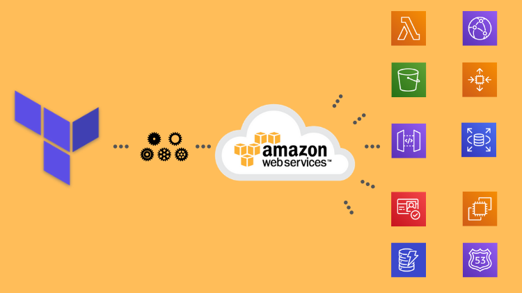

<h1 align="center">


<h3> <p align="center"> TEMPLATES TERRAFORM  </p> </h3>
<h3> <p align="center"> ================= </p> </h3>

>> <h3> Solution Architecture </h3>




>> <h3> Description </h3>

<p> Este projeto é uma serie de templates de Terraform para uso e reuso de diferentes tipos de infraestrutura na AWS.
São templates para uso de site estático (AWS S3 / Route53) com certificado SSL (AWS Certificate Manager) e CDN (CloudFront),
 aplicação auto-escalável (EC2, VPC, Load Balancer, Auto Scaling Group) e aplicação Serverless (AWS Lambda, API Gateway, DynamoDB, Cognito, CloudWatch, SNS). </p>

>> <h3> How to Run </h3>

in your terminal (linux ou mac) install Terraform with:

```
source install_terraform.sh

```
